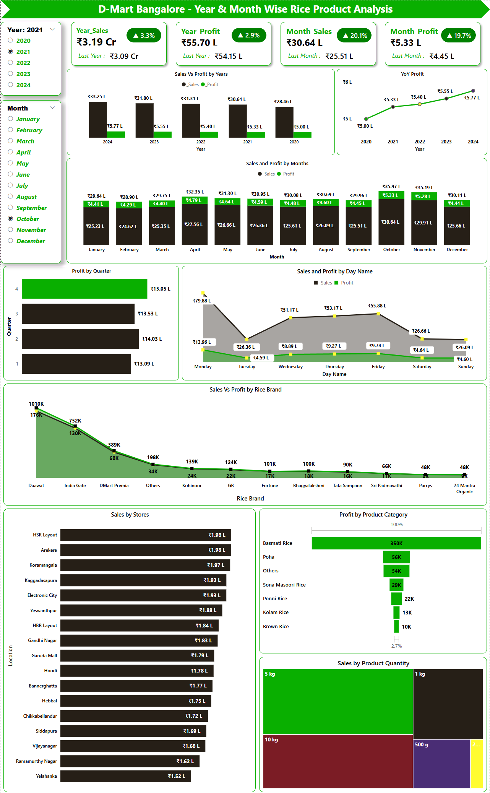

# 2020 – 2024 Sales Performance of Bangalore D - Mart Stores Rice Products Analysis
## 🌐 Live Dashboard

- Click Here to View Live Dashboard: [https://app.powerbi.com/view?r=eyJrIjoiNTg3N2VhYjItOGMxMi00ODhjLWE5MDMtNmM1NDljYzc5YTgwIiwidCI6IjhjZmNiNGI1LTQ3N2YtNDE3Zi1iMjRiLTE0MjZhODBjMWQ2MCJ9]

---

## 📌 Project Overview
- Tool Used: *Microsoft Power BI*
- Domain: *Retail Stores Analysis*
- Duration: *4 Days*
- Objective: *To analyse the sales and profit performance of rice products across Bangalore D-Mart stores.*
  - By Years
  - By Months
  - By Stores
  - By Rice Brands
  - By Product Category
  - By Product Quantity
  
---

## ⏱️ By Years

### 📊 Analysis
- 2020 – Sales – ₹3.09 Cr, Profit – ₹64.10 L
- 2021 – Sales – ₹3.19 Cr, Profit – ₹66.22 L
- 2022 – Sales – ₹3.27 Cr, Profit – ₹67.96 L
- 2023 – Sales – ₹3.38 Cr, Profit – ₹70.24 L
- 2024 – Sales – ₹3.50 Cr, Profit – ₹72.50 L

### 🎯 Conclusion
- Sales and profit have grown steadily by around 2% per year.
- 2022 showed the lowest growth (1.7% in sales and 0.51% in profit).

---

## ⏱️ By Months

### 📊 Analysis
- Highest Months: October & November
- Avg. Sales: ₹1.55 Cr | Avg. Profit: ₹31.55 L
- Moderate Months: April, May & July
- Avg. Sales: ₹1.36 Cr | Avg. Profit: ₹28.46 L
- Other Months:
- Avg. Sales: ₹1.31 Cr | Avg. Profit: ₹27.71 L

### 🎯 Conclusion
- October & November are the festival months so Sales and Profit is higher than normal months.
- April, May, July, sales is increasing 5 crores but compare to Rest all Month Profits only increased 0.4%. Because of the highest discount may affects the Profits.
